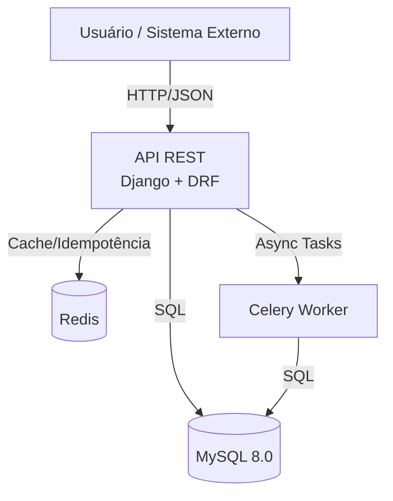
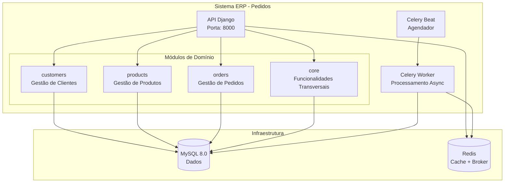
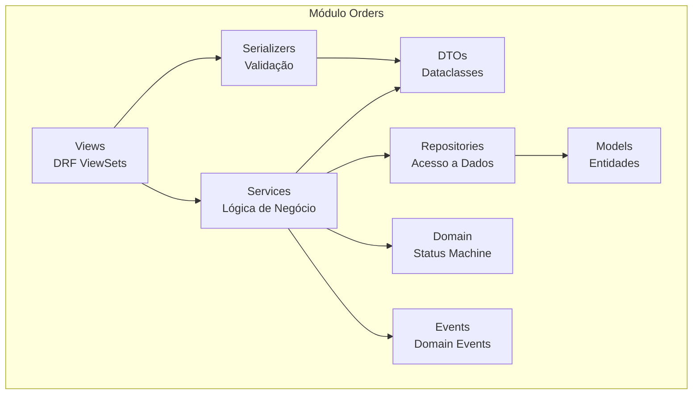
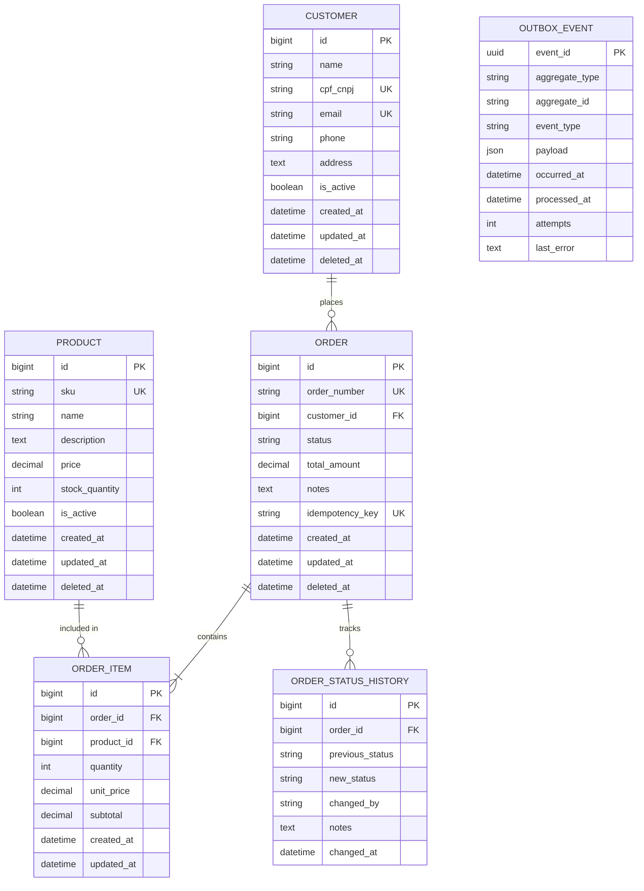
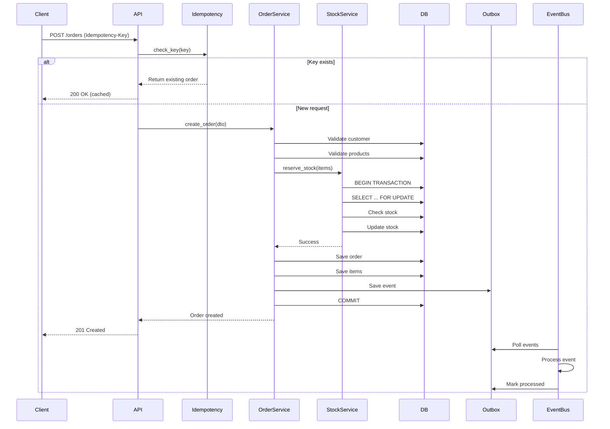
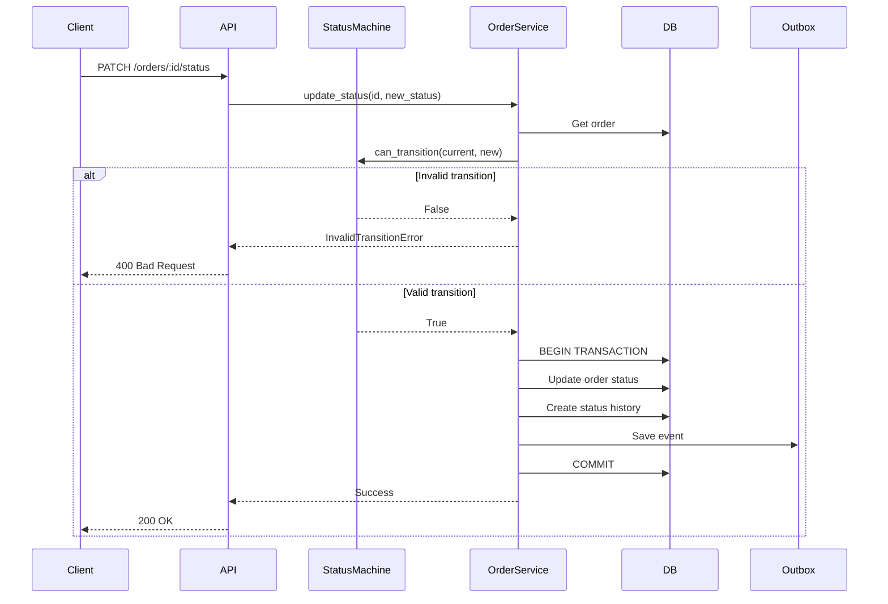

# Documentação de Arquitetura
## Sistema ERP - Módulo de Gestão de Pedidos

---

## 1. Visão Geral

Este documento descreve a arquitetura do Sistema de Gestão de Pedidos, incluindo padrões adotados, fluxo de dados, decisões técnicas e trade-offs.

### 1.1 Tipo de Arquitetura

**Monolito Modular** - Arquitetura híbrida que combina a simplicidade de deployment de um monolito com a organização e separação de concerns de microsserviços.

### 1.2 Justificativa

| Aspecto | Monolito Modular | Microsserviços |
|---------|------------------|----------------|
| Consistência de Dados | ✅ ACID nativo | ⚠️ Saga/2PC complexo |
| Simplicidade Operacional | ✅ Single deploy | ⚠️ Orquestração complexa |
| Performance | ✅ In-process calls | ⚠️ Network latency |
| Escalabilidade | ⚠️ Scale whole app | ✅ Scale individual |
| Time to Market | ✅ Rápido | ⚠️ Mais lento |

Para um módulo de ERP com requisitos de consistência forte, o Monolito Modular oferece o melhor custo-benefício.

---

## 2. Diagrama de Contexto (C4 - Level 1)



---

## 3. Diagrama de Containers (C4 - Level 2)



---

## 4. Diagrama de Componentes (C4 - Level 3)

### 4.1 Módulo de Pedidos (orders)



---

## 5. Diagrama ER (Entidade-Relacionamento)



---

## 6. Fluxo de Criação de Pedido



---

## 7. Fluxo de Atualização de Status



---

## 8. Padrões Arquiteturais Adotados

### 8.1 Repository Pattern

```python
# Interface
class CustomerRepositoryInterface(ABC):
    @abstractmethod
    def get_by_id(self, id: int) -> Customer: ...
    
    @abstractmethod
    def create(self, data: CustomerCreateDTO) -> Customer: ...

# Implementação
class DjangoCustomerRepository(CustomerRepositoryInterface):
    def get_by_id(self, id: int) -> Customer:
        return Customer.objects.get(id=id)
```

**Benefícios:**
- Abstração do ORM
- Facilidade de teste (mocks)
- Troca de implementação sem afetar camadas superiores

### 8.2 Service Layer

```python
class OrderService:
    def __init__(
        self,
        order_repo: OrderRepositoryInterface,
        stock_service: StockReservationService,
        idempotency_service: IdempotencyService
    ):
        self.order_repo = order_repo
        self.stock_service = stock_service
        self.idempotency_service = idempotency_service
    
    def create_order(self, dto: OrderCreateDTO) -> Order:
        # Lógica de negócio
        pass
```

**Benefícios:**
- Separação de concerns
- Reutilização de lógica
- Testabilidade

### 8.3 DTOs (Data Transfer Objects)

```python
@dataclass
class OrderCreateDTO:
    customer_id: int
    items: List[OrderItemCreateDTO]
    notes: Optional[str]
    idempotency_key: str
```

**Benefícios:**
- Contratos explícitos
- Validação de entrada
- Separação de modelos de domínio

### 8.4 Domain Events + Outbox Pattern

```python
# Evento
@dataclass
class OrderCreatedEvent:
    order_id: int
    customer_id: int
    total_amount: Decimal
    occurred_at: datetime

# Outbox
class OutboxEvent(models.Model):
    event_id = models.UUIDField(primary_key=True)
    event_type = models.CharField(max_length=100)
    payload = models.JSONField()
    occurred_at = models.DateTimeField(auto_now_add=True)
    processed_at = models.DateTimeField(null=True)
```

**Benefícios:**
- Desacoplamento
- Garantia de entrega
- Recuperação de falhas

---

## 9. Estratégia de Concorrência

### 9.1 Lock Pessimista

```python
# Reserva atômica de estoque
with transaction.atomic():
    products = Product.objects.select_for_update().filter(
        id__in=[item.product_id for item in items]
    ).order_by('id')  # Prevenir deadlock
    
    for item in items:
        product = products.get(id=item.product_id)
        if product.stock_quantity < item.quantity:
            raise InsufficientStockError()
        product.stock_quantity -= item.quantity
        product.save()
```

### 9.2 Prevenção de Deadlock

1. **Ordenação consistente**: Sempre bloquear recursos na mesma ordem
2. **Timeouts**: Definir timeouts para operações de banco
3. **Retry**: Retry automático em caso de deadlock

---

## 10. Estratégia de Idempotência

### 10.1 Implementação

```python
class IdempotencyService:
    def check_or_create_key(self, key: str, ttl: int = 86400) -> Tuple[bool, Optional[int]]:
        # Tentar SET NX no Redis
        is_new = redis.set(key, "pending", nx=True, ex=ttl)
        
        if not is_new:
            # Key exists, get order ID
            order_id = self.get_order_by_key(key)
            return False, order_id
        
        return True, None
```

### 10.2 Fluxo

1. Cliente envia requisição com `Idempotency-Key`
2. Sistema verifica se chave existe
3. Se existe: retorna pedido existente (200)
4. Se não existe: processa e armazena chave

---

## 11. Decisões Técnicas e Trade-offs

### 11.1 MySQL vs PostgreSQL

**Decisão:** MySQL 8.0

**Motivos:**
- Requisito obrigatório do teste
- Bom suporte a transações ACID
- `SELECT FOR UPDATE` funciona bem

**Trade-offs:**
- Menos recursos avançados que PostgreSQL
- JSON support mais limitado

### 11.2 Redis para Cache e Idempotência

**Decisão:** Redis para ambos

**Motivos:**
- Requisito obrigatório do teste
- Performance para operações atômicas
- TTL nativo para idempotência

**Trade-offs:**
- Ponto único de falha (mitigado com fallback para DB)

### 11.3 Django ORM vs SQLAlchemy

**Decisão:** Django ORM

**Motivos:**
- Integração nativa com Django
- Migrations automáticas
- Familiaridade da equipe

**Trade-offs:**
- Menos flexível que SQLAlchemy
- Pode gerar queries sub-ótimas (mitigado com análise)

### 11.4 Celery vs RQ

**Decisão:** Celery

**Motivos:**
- Mais maduro e documentado
- Suporte a scheduled tasks
- Integração com Django

**Trade-offs:**
- Mais complexo de configurar
- Overhead para casos simples

---

## 12. Escalabilidade e Performance

### 12.1 Estratégias

| Estratégia | Implementação |
|------------|---------------|
| Database Indexing | Índices em campos de busca frequente |
| Query Optimization | select_related, prefetch_related |
| Caching | Redis para cache de consultas |
| Async Processing | Celery para tarefas em background |
| Connection Pooling | Configuração do MySQL/Redis |

### 12.2 Métricas de Performance

| Métrica | Meta |
|---------|------|
| Latência P95 | < 200ms |
| Latência P99 | < 500ms |
| Throughput | > 1000 req/s |
| Cobertura de Testes | > 60% |

---

## 13. Segurança

### 13.1 Medidas Implementadas

- **Rate Limiting**: Prevenção de abuse
- **Input Validation**: Sanitização de entradas
- **SQL Injection**: Proteção via ORM parametrizado
- **XSS**: Sanitização de outputs
- **PII Protection**: Mascaramento em logs

### 13.2 Headers de Segurança

```
X-Content-Type-Options: nosniff
X-Frame-Options: DENY
X-XSS-Protection: 1; mode=block
Strict-Transport-Security: max-age=31536000
```

---

## 14. Monitoramento e Observabilidade

### 14.1 Logs Estruturados

```json
{
  "timestamp": "2024-01-01T00:00:00Z",
  "level": "INFO",
  "correlation_id": "550e8400-e29b-41d4-a716-446655440000",
  "message": "Order created",
  "context": {
    "order_id": 123,
    "customer_id": 456,
    "total_amount": 999.99
  }
}
```

### 14.2 Health Checks

- `/health`: Status da aplicação e dependências
- Métricas de banco de dados
- Métricas de Redis

### 14.3 Métricas

- Request rate
- Error rate
- Latency (P50, P95, P99)
- Database connections
- Cache hit rate

---

## 15. Referências

- [Django Documentation](https://docs.djangoproject.com/)
- [Django REST Framework](https://www.django-rest-framework.org/)
- [C4 Model](https://c4model.com/)
- [Clean Architecture](https://blog.cleancoder.com/uncle-bob/2012/08/13/the-clean-architecture.html)
- [Domain-Driven Design](https://domainlanguage.com/ddd/reference/)

---

*Documentação criada para o Teste Técnico Desenvolvedor Backend Pleno ERP*
