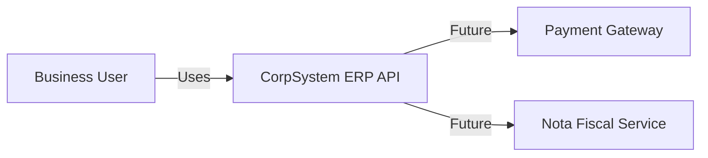
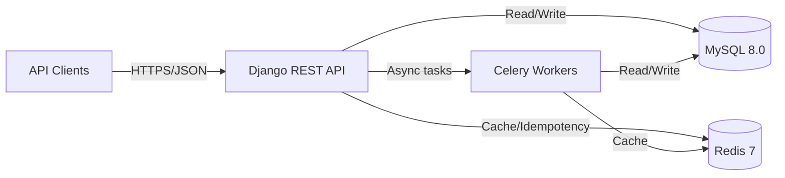
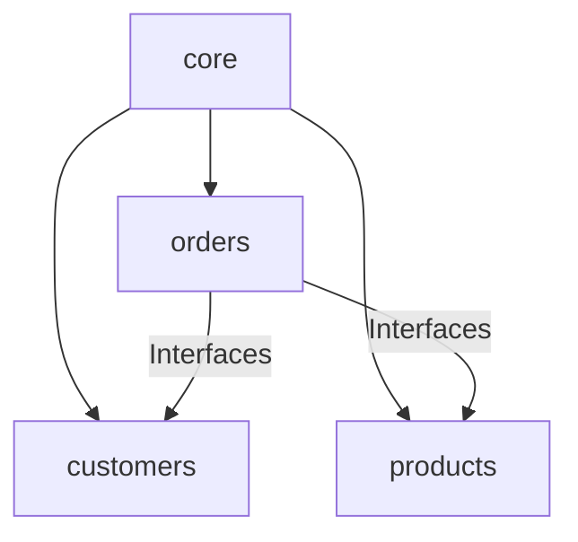

# CorpSystem ERP – Architecture

## 1. Overview
**Problem Domain:** Corporate ERP order management with strict consistency and traceability.

**Quality Attributes:**
- **Consistency:** ACID transactions for stock and order state.
- **Traceability:** Status history + structured logs with correlation IDs.
- **Extensibility:** Modular Monolith boundaries + Service Layer.
- **Performance:** Optimized queries and bounded N+1.

## 2. C4 Model (Mermaid)

### 2.1 C4 – Context Diagram

### 2.2 C4 – Container Diagram

### 2.3 Module Dependency Diagram

## 3. Architectural Decisions (ADR Summary)

### 3.1 Modular Monolith
**Why not microservices now?** The current team size and scope favor low operational complexity and
strong consistency. The Modular Monolith provides clear boundaries while maintaining in-process
communication and ACID guarantees. See `docs/ADR-001-Architecture-Modular-Monolith.md`.

### 3.2 Sync vs Async
- **Sync:** Reads and stock reservation for orders (critical consistency).
- **Async:** Notifications, integrations, and background processing via Celery.

### 3.3 Database Strategy
- **Single MySQL database** with logical separation by module (table prefixes and strict FK usage).
- **Transactional boundaries** enforced at the Service Layer using atomic operations.

## 4. Implemented Patterns
- **Repository Pattern:** ORM isolation for clean dependency inversion.
- **Service Layer:** Business rules live outside views and serializers.
- **DTOs:** Typed data contracts using Pydantic.
- **Outbox Pattern:** Reliable domain event publishing.
- **Idempotency:** Redis-backed keys to prevent duplicate order creation.

## 5. Development Guide

### 5.1 Where to place new logic
- **Service:** Business rules, orchestration, transactions.
- **Model:** Data validation and invariants.
- **View:** HTTP concerns only (serialization, status codes).

### 5.2 Creating a new module
1. Create module folder under `src/modules/<module>`.
2. Add `apps.py`, `models.py`, `repositories/`, `services.py`, `views.py`, `serializers.py`.
3. Register module in `INSTALLED_APPS` and `config/urls.py`.

### 5.3 Dependency Rules
- `core` does not depend on other modules.
- Business modules depend only on `core` and interfaces, never concrete repositories.
- Cross-module reads use public services/interfaces, not direct model imports.

## 6. Folder Map
- `src/config/`: Django settings, URL config, Celery app.
- `src/modules/core/`: Base models, shared middleware, pagination, interfaces.
- `src/modules/customers/`: Customer domain.
- `src/modules/products/`: Product catalog + stock.
- `src/modules/orders/`: Order aggregate, state machine, history.
- `tests/`: Unit + integration tests.
